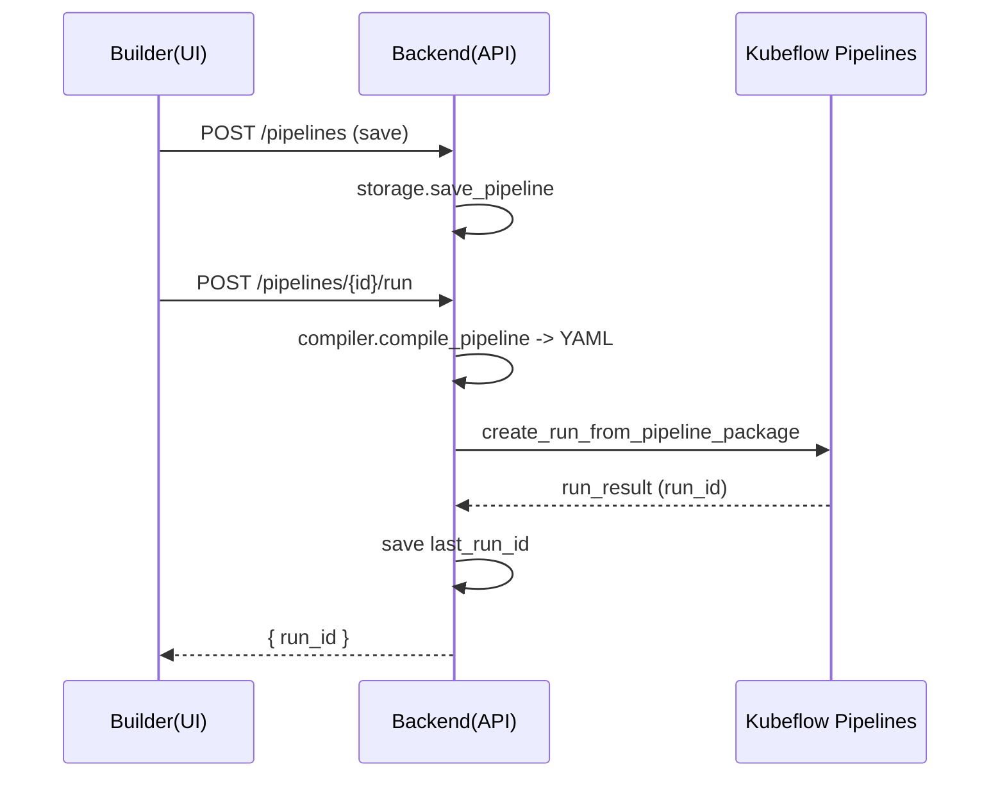

# 项目设计

## 技术架构
- 前端：Vue 3 + Vite + Vue Router + Vue Flow + Axios
- 后端：FastAPI + Pydantic + KFP v2 SDK
- 编译与提交：动态生成 KFP Pipeline YAML 并通过 SDK 提交运行
- 存储：本地文件系统 JSON（`data/components`、`data/pipelines`）
- 运行：本机服务，前后端通过 REST API 通信，启用 CORS

## 前端设计
- 页面与组件
  - `src/views/PipelinesList.vue` 管道列表与状态刷新
  - `src/views/PipelineBuilder.vue` 画布编辑器、还原、提交运行、状态拉取
  - `src/components/ComponentForm.vue` 组件创建/编辑表单
  - `src/components/PropertyPanel.vue` 节点参数与资源面板
  - `src/components/PipelineNode.vue` 节点渲染与状态样式
- 数据流
  - 通过 `axios` 调用后端 API 加载组件/管道与状态数据
  - 运行提交时打包节点与边，并包含节点资源覆盖
- 节点 ID 策略
  - 新建时按 `node_${id++}` 生成
  - 载入已保存管道后，将计数器提升到当前最大序号+1，避免新节点覆盖已有节点
- 状态展示
  - 节点的运行状态写入 `data.runtimeStatus` 并以颜色徽标展示

## 后端设计
- 模块与职责
  - `main.py`：FastAPI 路由，组件/管道 CRUD，运行提交，状态查询与映射
  - `kfp_client.py`：KFP 提交与状态解析（兼容 v1/v2 与 REST 回退）
  - `compiler.py`：动态生成 Pipeline 与组件 YAML，拓扑排序、数据/依赖绑定、资源应用
  - `storage.py`：JSON 持久化与读取
  - `models.py`：Pydantic 数据模型与校验
- KFP 集成
  - 提交运行：`create_run_from_pipeline_package`
  - 状态查询：支持 v1 `workflow_manifest`、v2 `run_details`、`to_dict()/to_json()` 与 REST 回退
- 节点状态映射
  - 规则：`<node_id>-<componentName>` 前缀、唯一的节点 `label`、Pipeline 内唯一组件名
  - 输出为 `node_id -> state` 映射，前端据此渲染画布节点状态

## 数据模型
| 模型 | 关键字段 |
| --- | --- |
| Component | `id`、`name`、`description`、`image`、`command`、`args`、`inputs[]`、`outputs[]`、`resources{cpu_request,cpu_limit,memory_request,memory_limit,gpu_limit}`、`volcano_enabled` |
| PipelineNode | `id`、`component_id`、`label`、`position{x,y}`、`args{}`、`resources{}` |
| PipelineEdge | `id`、`source`、`target`、`sourceHandle?`、`targetHandle?` |
| Pipeline | `id`、`name`、`description?`、`nodes[]`、`edges[]`、`last_run_id?` |

## 接口设计
| 方法 | 路径 | 请求 | 响应 |
| --- | --- | --- | --- |
| POST | `/components` | `Component` | `Component` |
| GET | `/components` | - | `Component[]` |
| GET | `/components/{id}` | - | `Component` |
| DELETE | `/components/{id}` | - | `{status}` |
| POST | `/pipelines` | `Pipeline` | `Pipeline` |
| GET | `/pipelines` | - | `Pipeline[]` |
| GET | `/pipelines/{id}` | - | `Pipeline` |
| DELETE | `/pipelines/{id}` | - | `{status}` |
| POST | `/pipelines/{id}/run` | - | `{status, run_id}` |
| GET | `/pipelines/{id}/status` | - | `{run_id?, status}` |
| GET | `/pipelines/{id}/nodes/status` | - | `{[node_id]: state} 或 {[display_name]: state}` |

## 提交流程（Mermaid）


## 节点状态映射流程（Mermaid）
```mermaid
flowchart TD
  A[client.get_run(run_id)] --> B{v1 workflow_manifest?}
  B -- yes --> C[parse nodes: displayName/phase]
  B -- no --> D{run.to_dict/to_json?}
  D -- yes --> E[walk dict/list find name/state]
  D -- no --> F{run_details?}
  F -- yes --> G[items: task_runs/tasks/nodes/task_details<br/>fields: display_name/state]
  F -- no --> H{REST v2 /task_runs or /tasks}
  H -- yes --> I[parse display_name/state]
  H -- no --> J[empty {}]
  C --> K[statuses{name->state}]
  E --> K
  G --> K
  I --> K
  K --> M{map to node_id}
  M -->|prefix <node_id>-| N[node_id->state]
  M -->|unique label| N
  M -->|unique componentName| N
```

## 部署与运行
- 前端开发：`npm run dev`
- 前端构建：`npm run build`；预览：`npm run preview`
- 后端启动：`uvicorn main:app --host 0.0.0.0 --port 8000`（代码中内置启动）
- CORS：允许前端跨域访问

## 配置
- 环境变量
  - `KFP_ENDPOINT` 默认 `http://localhost:30088`
  - `PIPELINE_ROOT` 默认 `s3://mlpipeline/test-pipeline-root`
- 认证与存储
  - MinIO 凭据通过 K8s Secret 注入为容器环境变量

## 安全与治理
- 不在仓库硬编码密钥；通过 Secret 注入
- 接口错误处理统一返回 4xx/5xx
- 资源字段校验与默认值由 Pydantic 管理

